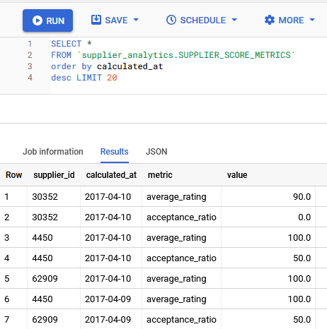
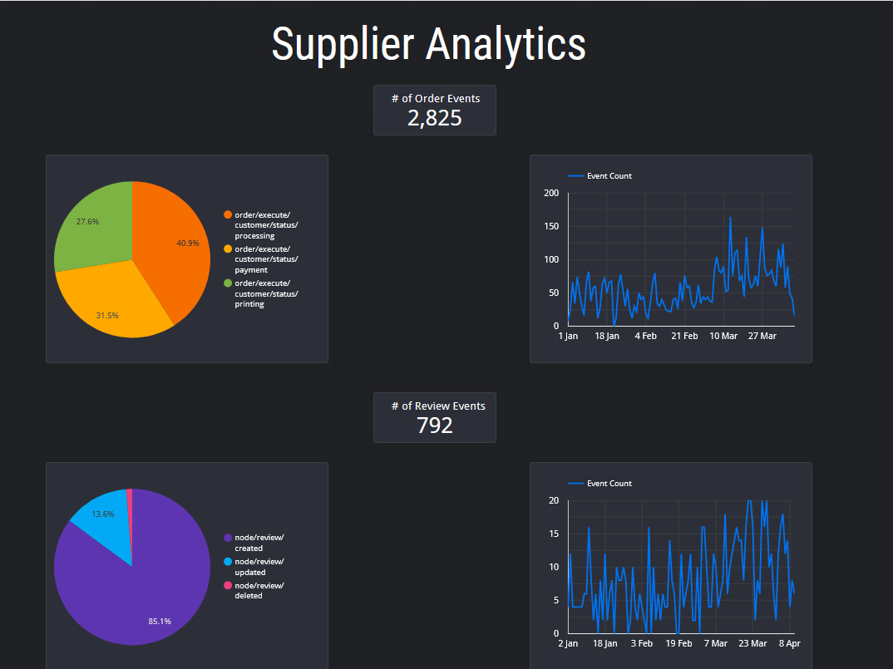
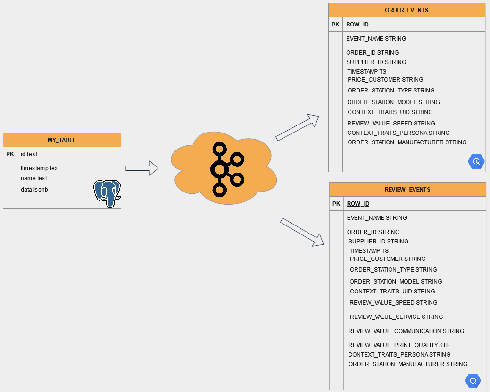

# supplier-analytics-provider

Supplier Analytics Provider represents an end-to-end data pipeline to provide insight on business domain by using behavioral event data. 
It consists of a Postgres database , open source Kafka Connect connectors, Kafka, KSQL and Google BigQuery. For data visualization and reporting purporses Google Data Studio is preferred.

### Tech

supplier-analytics-provider uses following projects to work properly:

* [Postgres](https://www.postgresql.org/) - A relational database management system
* [Confluent](https://www.confluent.io/) - A popular Kafka vendor
* [ksqlDB](https://ksqldb.io/) - The event streaming database purpose-built for stream processing applications.
* [BigQuery](https://cloud.google.com/bigquery) - Google's Data warehouse solution
* [Data Studio](https://datastudio.google.com/) - Google's Data Visualization

## Requirements
1. Java 1.8+
3. An up and running Docker service
4. A Google Cloud Platform Service Account file with BigQuery privileges


### Brief Architecture

* supplier-analytics-provider project uses PostgresSQL on transactional database source part.
* Open source edition of Confluent has been implemented.
* Kafka Connect is the key module which transmits the incoming data from PostgreSQL as Change Data Capture events.
* Transformation layer happens inside ksqlDB. Order and Review streams are created here.
* Kafka Connect's BigQuery Sink Connector consume Kafka topics into Google's BigQuery.
* There is one-to-one relationship between topics and tables on BigQuery.

## Run
Ignite Docker to make cluster up and running.

```sh
$ docker-compose up -d
```

## Steps to Go Live

1. An SQL file provided to generate transactional data into PostgreSQL tables. a PgAdmin UI has been provided to execute DDLs and DMLs. Terminal approach can also be used as follows.
    ```sh
      $ cd queries/
      $ >psql hubs_events.sql
      ```
2. Use connector-creation-requests to start the flow from Postgres to Kafka as follows.
   ```sh
   $ cd connect-requests/
   $ curl -i -X POST -H "Accept:application/json" -H  "Content-Type:application/json" http://localhost:8083/connectors/ -d @register-postgres.json
      ```
3. Once the CDC flow started from source database to Kafka, KSQL transformation can be applied by following steps.
      ```sh
   $ docker exec -it ksqldb-cli ksql http://ksqldb-server:8088
   $ ksql> {EXECUTE QUERIES UNDER queries/queries.sql}
      ```
   With this ORDER_EVENTS and REVIEW_EVENTS streams are ready to be sent to BigQuery.
   
4. Use connector-creation-requests to start to flow from Kafka to BigQuery as follows.
      ```sh
   $ cd connect-requests/
   $ curl -i -X POST -H "Accept:application/json" -H  "Content-Type:application/json" http://localhost:8083/connectors/ -d @register-bigquery-sink.json
      ```
5. Observe tables under Google Cloud Platform's BigQuery Datasets.
   
6. Examine `queries/SUPPLIER_SCORE_METRICS.sql` file. With the event tables streamed into BigQuery, we are now set to go to perform any analytics query.

## SUPPLIER_SCORE_METRICS

* One of the application of this exercise is the SUPPLIER_SCORE_METRICS table. It has been generated on BigQuery with a view creation process.
Following executed query gives an intuition of the metrics calculated.

#### Assumptions

- Hub ID field corresponds to supplier id in our case.
- Acceptance Ratio and Average Rating metrics represent Supplier's daily behaviors.
_ Any ORDER with PRINTING status represents an accepted order.




# Visuals

## High-level Architecture


## Reporting Dashboard



## Database Design

